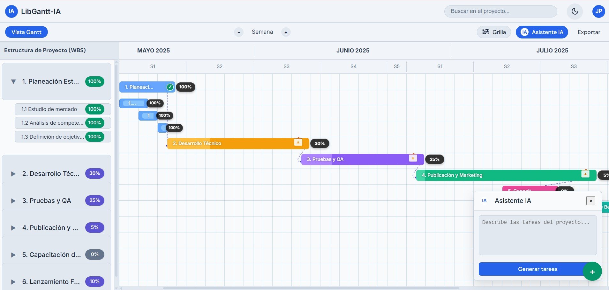

# 🚀 LibXAI Suite

### AI-Powered Gantt Chart Generator for Smart Project Management

<p align="center">
  
</p>

<div align="center">

[](https://choosealicense.com/licenses/mit/)
[](https://reactjs.org/)
[](https://www.typescriptlang.org/)
[](https://vitejs.dev/)

</div>

---

## 🌟 Application Preview

> **🎯 Project Management Redefined**: Experience intelligent timelines with automatic progress tracking, real-time predictive analytics, and integrated AI assistant.

### 🖥️ Featured Visual Characteristics

- **📊 Smart Timeline**: Clear visualization from May to July 2025 with real-time progress
- **🎨 Modern Design**: Professional dark interface with colorful elements for better UX
- **📈 Progress Indicators**: Dynamic progress bars (100%, 30%, 25%, 5%, 0%, 10%)
- **🤖 AI Assistant**: Integrated side panel for automatic task optimization
- **⚡ Smart WBS**: Work Breakdown Structure with visual hierarchy

---

## 🎯 Overview

LibXAI Suite is a cutting-edge AI-powered Gantt chart library that **revolutionizes project management** through intelligent automation and predictive analytics. Built with modern web technologies, it provides developers with powerful tools to create smart and adaptive project timelines.

## ✨ Key Features

### 🤖 **Advanced Artificial Intelligence**

```
🎯 Smart Task Scheduling    → Automatic sequence optimization
📊 Predictive Analytics     → Date prediction and bottleneck identification
🔄 Intelligent Resource Allocation    → AI distribution and conflict resolution
⚠️ Risk Assessment         → Automated risk identification
```

### 📊 **Advanced Gantt Capabilities**

- **🎭 Interactive Timeline**: Drag-and-drop management + real-time updates
- **🔗 Dependency Management**: Smart mapping of task relationships
- **🎯 Critical Path Analysis**: Automated identification of critical tasks
- **🌐 Multi-project Views**: Manage multiple projects with unified dashboards

### 🎨 **Modern UX/UI**

- ✅ **Responsive Design**: Perfect on desktop, tablet, and mobile
- 🌓 **Dark/Light Themes**: Customizable appearance modes
- 👥 **Real-time Collaboration**: Multi-user editing with live synchronization
- 📤 **Export Capabilities**: PDF, PNG, and Excel

---

## 🛠️ Tech Stack

<table>
<tr>
<td width="50%">

**🎨 Frontend**

- React 19.0 + TypeScript 5.7
- Vite 6.3 for ultra-fast development
- Modern CSS with CSS Modules

</td>
<td width="50%">

**🤖 AI Backend**

- Custom algorithms for scheduling
- React Context + Hooks pattern
- Jest + React Testing Library

</td>
</tr>
</table>

---

## 📦 Installation and Setup

### **🚀 Clone and run locally:**

```bash
# 📂 Clone the repository
git clone https://github.com/libxai/ganttAI.git

# 📁 Navigate to directory
cd ganttAI

# 📦 Install dependencies
npm install

# 🚀 Start development server
npm run dev

# 🏗️ Build for production
npm run build
```

### **📋 As a library (coming soon to NPM):**

```bash
# 🎯 Install via npm (when published)
npm install libxai-suite

# 🧶 Install via yarn
yarn add libxai-suite

# ⚡ Install via pnpm
pnpm add libxai-suite
```

## 🚀 Usage Example

```typescript
import { GanttChart, AIScheduler } from "libxai-suite";

const MyProject = () => {
  const tasks = [
    {
      id: "1",
      title: "Strategic Planning",
      start: "2025-06-01",
      duration: 5,
      progress: 100,
      dependencies: [],
    },
    {
      id: "2",
      title: "Technical Development",
      start: "2025-06-06",
      duration: 15,
      progress: 30,
      dependencies: ["1"],
    },
    {
      id: "3",
      title: "Testing and QA",
      start: "2025-07-01",
      duration: 10,
      progress: 25,
      dependencies: ["2"],
    },
  ];

  return (
    <GanttChart
      tasks={tasks}
      aiEnabled={true}
      theme="dark"
      showProgress={true}
      onTaskUpdate={(optimizedTasks) => {
        console.log("🤖 AI-optimized tasks:", optimizedTasks);
      }}
      onAIAssist={(suggestions) => {
        console.log("💡 AI suggestions:", suggestions);
      }}
    />
  );
};
```

---

## 📈 **AI Features in Detail**

<div align="center">

### 🧠 **Proprietary AI Engine**

</div>

| Functionality                 | Description                       | Benefit                   |
| ----------------------------- | --------------------------------- | ------------------------- |
| 📊 **Historical Analysis**    | Analyzes past project data        | More accurate predictions |
| ⚡ **Real-time Optimization** | Automatic timeline adjustments    | Maximized efficiency      |
| 🎯 **Pattern Detection**      | Identifies trends and bottlenecks | Proactive prevention      |
| 🔮 **Smart Forecasting**      | Predicts completion dates         | Reliable planning         |

---

## 🎯 **Real-world Use Cases**

<table>
<tr>
<td width="33%">

### 💻 **Software Development**

- Sprint planning
- Release management
- Bug tracking
- Continuous integration

</td>
<td width="33%">

### 🏗️ **Construction Projects**

- Timeline optimization
- Resource scheduling
- Quality control
- Vendor management

</td>
<td width="33%">

### 📱 **Marketing Campaigns**

- Multi-channel coordination
- Product launches
- Corporate events
- ROI analysis

</td>
</tr>
</table>

---

## ⚡ **Performance Metrics**

<div align="center">

| Metric                  | Value        | Status        |
| ----------------------- | ------------ | ------------- |
| 🚀 **Rendering**        | >1000 tasks  | ✅ Optimized  |
| ⚡ **Response Time**    | <100ms       | ✅ Ultra-fast |
| 📱 **Lighthouse Score** | 95+          | ✅ Excellent  |
| 🌐 **Compatibility**    | All browsers | ✅ Universal  |

</div>

---

## 🗺️ **Roadmap**

### 🎯 **Version 2.0** (Q3 2025)

- [ ] 🧠 Machine Learning integration for pattern recognition
- [ ] 🔄 Advanced AI-driven resource optimization
- [ ] 🔗 Integration with Jira, Asana, Monday.com
- [ ] 📱 Companion mobile app iOS/Android

### 🚀 **Version 2.1** (Q4 2025)

- [ ] 🗣️ Natural Language Processing for task creation
- [ ] 📊 Automated status reports with AI insights
- [ ] 📈 Advanced analytics dashboard with ML
- [ ] 🔐 Enterprise SSO integration (SAML, OAuth)

---

## 🔧 **Development Setup**

```bash
# 📂 Clone the repository
git clone https://github.com/libxai/ganttAI.git

# 📁 Navigate to directory
cd ganttAI

# 📦 Install dependencies
npm install

# 🚀 Start development server
npm run dev

# 🏗️ Build for production
npm run build

# 🧪 Run tests
npm run test

# 👀 Production preview
npm run preview
```

---

## 🤝 **Contributing**

We welcome contributions! Please see our [**Contributing Guidelines**](CONTRIBUTING.md).

```bash
# 🍴 Fork the repository
# 🌿 Create feature branch
git checkout -b feature/amazing-feature

# 💾 Commit changes
git commit -m '✨ Add amazing feature'

# 📤 Push to branch
git push origin feature/amazing-feature

# 🔄 Open Pull Request
```

---

## 📞 **Contact and Support**

<div align="center">

| Channel            | Information                                                         |
| ------------------ | ------------------------------------------------------------------- |
| 👨‍💻 **Developer**   | fintechinsightai                                                    |
| 📧 **Email**       | hello@libxai.com                                                    |
| 🌐 **Website**     | [libxai.com](https://libxai.com)                                    |
| 🐛 **Issues**      | [GitHub Issues](https://github.com/libxai/ganttAI/issues)           |
| 💬 **Discussions** | [GitHub Discussions](https://github.com/libxai/ganttAI/discussions) |

</div>

---

## 📊 **Project Stats**

<div align="center">


</div>

---

<div align="center">

### 📄 **License**

This project is licensed under the **MIT License** - see the [LICENSE](LICENSE) file for details.

### 🌟 **Acknowledgments**

Built with 🤖 **AI** and ❤️ **human creativity** by the **LibXAI** team

**Join the intelligent project management revolution!** 🚀

</div>
