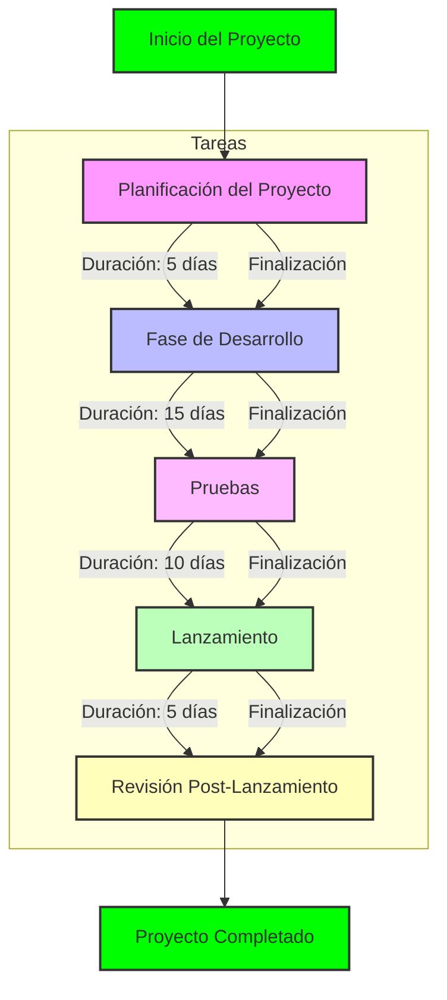

# Schedule Network Diagram

**Generated by Requirements Gathering Agent v2.0.0**  
**Category:** planning-artifacts  
**Generated:** 2025-06-03T00:39:32.098Z  
**Description:** PMBOK Schedule Network Diagram

---

Below is a detailed Schedule Network Diagram using Mermaid syntax for the LibXAI Suite project:

### Explanation of the Diagram:
- **Nodes**:
  - **A**: "Planificación del Proyecto" (Planning of the Project) - Duration: 5 days.
  - **B**: "Fase de Desarrollo" (Development Phase) - Duration: 15 days.
  - **C**: "Pruebas" (Testing) - Duration: 10 days.
  - **D**: "Lanzamiento" (Launch) - Duration: 5 days.
  - **E**: "Revisión Post-Lanzamiento" (Post-Launch Review) - Duration: 5 days.
  
- **Dependencies**:
  - Each task is dependent on the completion of the previous task. 
  - The arrows indicate the flow of the project from one task to the next.

- **Milestones**:
  - "Inicio del Proyecto" (Project Start) and "Proyecto Completado" (Project Completed) are added to signify the start and end of the project phases.

This diagram provides a clear visual representation of the project's tasks, their durations, and dependencies, which is helpful for project scheduling and management.